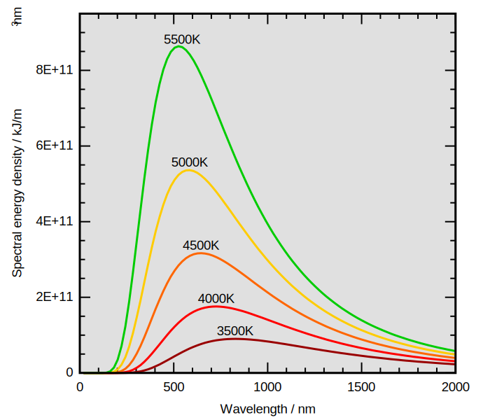

# Corpo Negro

## Lei de Stefan-Boltzmann

A primeira conjectura quantitativa sobre os corpos negros foi feita em 1879 por _Joseph Stefan_, na forma


A potencia por unidade de área \(densidade de energia\) $$u(T)$$ emitida por um corpo negro é proporcional a quarta potência da sua temperatura 

                                                                     $$\large{u(T)=\sigma T^4}$$ 

onde $$\sigma=5{,}67\times10^{-8}\frac{W}{m^2K^4}$$ e $$j(T)$$ é a potencia radiada por metro quadrado a uma dada temperatura $$T$$.


Tal expressão foi mais tarde deduzida por _Ludwig Boltzmann_ através de considerações termodinâmicas da radiação eletromagnética contida num caixa fechada com paredes reflexivas.

Imaginando um série de ondas planas monocromáticas contidas no interior do recipientes, é possível mostrar que a densidade de energia eletromagnética $$u$$ e a densidade de momento eletromagnético $$p_v$$ estão relacionados por meio da relação \([ver apêndice](apendices.md#densidades-de-energia-e-momento-eletromagnetico)\).



                                                                         $$\large{u=cp_v}$$ 



Tratando a radiação de corpo negro como um campo eletromagnético confinado numa cavidade cúbica \(de lados $$L$$\) de paredes metálicas \(reflexivas\), devido a ausência de cargas e correntes elétricas no seu interior, as equações de Maxwell tomam a forma

$$
\begin{matrix} (i)\ \nabla \cdot\vec{E}=0 \ & \ (iii)\ \nabla \times\vec{E}= -\dfrac{\partial \vec{B}}{\partial t} \\ (ii)\ \nabla \cdot\vec{B}=0 \ &\ (iv)\ \nabla \times\vec{B}=\mu_0\epsilon_0\dfrac{\partial \vec{E}}{\partial t}\end{matrix}
$$

Aplicando o rotacional em $$(iii)$$e $$(iv)$$  e desacoplando-as é possível reduzir as equações acima em

$$
\begin{matrix} (i)\ \nabla \cdot\vec{E}=0 \ & \ (iii)\ \nabla^2 \vec{E}= -\frac{1}{c}\dfrac{\partial^2 \vec{E}}{\partial t^2} \\ (ii)\ \nabla \cdot\vec{B}=0 \ &\ (iv)\ \nabla^2 \vec{B}= -\frac{1}{c}\dfrac{\partial^2 \vec{B}}{\partial t^2} \end{matrix}
$$

que são equações de ondas, que satisfazem



temos que

$$
dp=p_vdV=p_vdldA=p_v(cdt)dA
$$

Mas como, $$dF=\frac{dp_v}{dt}=cp_vdA=udA.$$ Temos que a pressão exercida pela radiação nas paredes deve ser dada por

$$
P=\frac{dF}{dA}=u
$$

Mas como espera-se que que a pressão seja a mesma que em todas as três direções independentes, temos que $$P=\frac{1}{3}u$$. Usando a relação fundamental da termodinâmica $$dU=TdS=PdV$$ a uma variação isotérmica do volume

$$
\left(\dfrac{\partial U}{\partial V}\right)_T=T\left(\dfrac{\partial S}{\partial V}\right)_T-P
$$

Assim, usando a relação de Maxwell $$\left(\frac{\partial S}{\partial V}\right)_T=\left(\frac{\partial P}{\partial T}\right)_V$$ e $$U=Vu(T)$$, temos que

$$
\dfrac{\partial }{\partial V}\left[Vu(T)\right]_T=T\left(\dfrac{\partial P}{\partial T}\right)_V-P
$$

Assim

$$
u=T\left(\dfrac{\partial P}{\partial T}\right)_V-P
$$

Para $$P=\frac{u}{3}$$ e $$dP=\frac{du}{3}$$, temos que:

$$
\frac{4}{3}u=\frac{T}{3}\frac{du}{dT}\implies4\frac{dT}{T}=\frac{du}{u}
$$

Que integrando, da origem á

$$
u(T)=\sigma T^4
$$

Que é a expressão para a lei de Stefan-Boltzmann.

## Lei do Deslocamento de Wien

Outra relação quantitativa a respeito da radiação de um corpo negro foi primeiramente proposta teoricamente por Wilhelm Wien em 1893 e afirma que


O comprimento de onda máximo para curva da distribuição espectral da emissão de um corpo negro é inversamente proporcional a sua temperatura

$$\lambda_{max}=\dfrac{b}{T}$$

com $$b=2{,}897\times10^{-3}mK$$


### Invariantes adiabáticos

A partir da [Lei de Stefan/Boltzmann ](corpo-negro.md#lei-de-stefan-boltzmann)onde $$u(T)=\sigma T^4$$ e das considerações a respeito da pressão exercida pelo campo eletromagnético no seu interior da cavidade deduzida naquela discussão, dado por $$P=\frac{1}{3}u$$ , tem-se que

$$
3P=u(T)=\sigma T^4
$$

Para um variação isovolumétrica da temperatura \(e usando a relação de Maxwell $$\left(\frac{\partial P}{\partial T}\right)_V=\left(\frac{\partial S}{\partial V}\right)_T$$ \)

$$
3\left(\dfrac{\partial P}{\partial T}\right)_V=3\left(\dfrac{\partial S}{\partial V}\right)_T=4\sigma T^3
$$

Logo, deduz-se que $$dS=d\left(\frac{4}{3}\sigma T^3 V\right)=4\sigma T^2 VdT+\frac{4}{3}\sigma T^3dV$$ , de forma que, para um processo adiabático \( $$dS=0$$ \), obtém-se

$$
4\sigma T^2\left(VdT+\frac{1}{3}TdV\right)=0 \implies\frac{dT}{T}=-\frac{1}{3}\frac{dV}{V}
$$

Cuja a integração direta resulta numa quantidade

$$
T^3 V=a=cte
$$

Que é o que chamamos de uma invariante adiabática, uma quantidade que mantém-se inalterada ao longo do processo que assumimos ser adiabático.

Acontece, que da análise da radiação contida em uma cavidade, verifica-se que \([Apêndice](apendices.md#onda-eletromagnetica-numa-cavidade) e [Análise da Lei de Rayleigh-Jeans](corpo-negro.md#lei-de-rayleigh-jeans)\) existe uma restrição dos possíveis valores das frequências

$$
\left(\frac{2\nu L}{c}\right)^2=\left(l^2+m^2+n^2\right) \ \ \text{com}  \ \ l,m,n=1,2,3,...
$$

Elevando a expressão a potência $$\frac{3}{2}$$, tem-se que $$\frac{8}{c^3}\nu^3L^3=\frac{8}{c^3}\nu^3V=\left(l^2+m^2+n^2\right)^{\frac{3}{2}}=cte$$ , permitindo encontrar uma nova invariante adiabática tomando o diferencial em ambos os lado

$$
\frac{8}{c^3}d\left(\nu^3V\right)=\frac{8}{c^3}\left(3\nu^2Vd\nu+\nu^3dV\right)=\frac{8}{c^3}\nu^2\left(3Vd\nu+\nu dV\right)=0
$$

Que dá origem as diferenciais separáveis $$\dfrac{d\nu}{\nu}=-\dfrac{1}{3}\dfrac{dV}{V}$$ , que por integração direta, dá origem ao nosso segundo invariante adiabático do sistema

$$
\nu^3V=b=cte
$$

Assim, introduzindo o primeiro invariante adiabático no segundo

$$
b=\nu^3V=\nu^3\left(\frac{a}{T^3}\right)\implies \frac{\nu}{T}=\left(\frac{b}{a}\right)^{\frac{1}{3}}=c=cte
$$

Obtemos um terceiro invariante adiabático: $$\frac{\nu}{T}=c=cte$$ .

### Forma funcional de u\(T,v\)

Seja

$$
u(T)=\int_0^\infty u(\nu,T)d\nu
$$

Para um processo na qual o sistema passa de uma temperatura $$T$$ inicial para uma outra $$T'$$ onde $$\dfrac{u(T)}{\int u(T,\nu)d\nu}=\dfrac{u(T')}{\int u(T',\nu')d\nu'}=1$$ , logo

$$
\int_0^\infty u(T',\nu') d\nu'=\frac{u(T')}{u(T)}\int_0^\infty u(T,\nu) d\nu
$$

Assim, a partir da [Lei de Stefan/Boltzmann](corpo-negro.md#lei-de-stefan-boltzmann) onde $$u(T)=\sigma T^4$$ , temos que $$\int_0^\infty u(T,\nu) d\nu=\frac{T'^4}{T^4}\int_0^\infty u(T,'\nu') d\nu'$$, e, portanto, utilizando nossa terceira invariante adiabática $$\frac{\nu'}{T'}=\frac{\nu}{T}$$ com $$\nu'=\frac{T'}{T}\nu$$ e $$d\nu'=\frac{T'}{T}d\nu$$

obtermos $$\int_0^\infty u(T',\frac{T'}{T}\nu) \frac{T'}{T}d\nu=\frac{T'^4}{T^4}\int_0^\infty u(T,\nu) d\nu$$. Sem perda de generalizada, fazendo $$T'=1$$, temos que $$u(T',\frac{T'}{T}\nu)=u(1,\frac{\nu}{T})=f(\frac{\nu}{T})$$e obtemos, portanto, que

$$
\int_0^\infty u(T,\nu)d\nu=\int_0^\infty T^3f\left(\frac{\nu}{T}\right)d\nu \implies u(T,\nu)=T^3f\left(\frac{\nu}{T}\right)
$$

Mas como $$\frac{\nu}{T}=c\implies T \propto \nu$$ , assim, obtemos como resultado que

$$
u(T,\nu)=\nu^3f\left(\frac{\nu}{T}\right)
$$

Que é a Lei de deslocamento de Wien numa versão mais modernizada descrevendo a forma funcional que a densidade de energia emitida por um corpo negro deve tomar. É surpreendente que a partir de poucas considerações termodinâmicas possamos conseguir restringir a forma funcional para tal classe de funções.

### Lei de Deslocamento

A partir da última expressão derivada para a forma funcional da densidade espectral de energia emitida por um corpo negro é fácil verificar, extremizando a função na forma

$$
\frac{d}{dt}u(\nu,T)|_{\nu_{max}}=3\nu^2f+\frac{\nu^3}{T}\frac{df}{dt}=\nu^2\left[f\left(\frac{\nu_{max}}{T}\right)+\frac{\nu_{max}^3}{T}\frac{df}{dt}\left(\frac{\nu_{max}}{T}\right)\right]=0
$$

De forma que devemos obter uma equação diferencial $$f\left(\frac{\nu_{max}}{T}\right)+\frac{\nu_{max}^3}{T}\frac{df}{dt}\left(\frac{\nu_{max}}{T}\right)=0$$, que independente da forma de sua solução, com as condições iniciais adequadas esperamos ter uma única solução mantendo $$\frac{\nu_{max}}{T}=c'=cte$$ , ou ainda, para $$\nu=\frac{c}{\lambda},$$é equivalente á

$$
\lambda_{max}=\frac{b}{T}
$$

Que é a expressão desejada para o deslocamento de Wien. Como esperado, a constante $$b$$ deve ser estimada empiricamente, não sendo acessível através dos métodos termodinâmicos.

## Lei de Rayleigh-Jeans

### Contando os Modos Normais de Oscilação

Tratando a radiação de corpo negro como um campo eletromagnético confinado numa cavidade cúbica \(lados $$L$$\) de paredes metálicas \(reflexivas\), é possível mostrar \([ver apêndice](apendices.md#onda-eletromagnetica-numa-cavidade)\) que a radiação deve consistir em ondas estacionárias com um espectro discreto para os possíveis valores de frequência



$$
\nu^2=\left(\frac{c}{2L}\right)^2\left(l^2+m^2+n^2\right)=\left(\frac{c}{2L}\right)^2p^2
$$

Com $$l,m,n=1,2,3,...,.$$



Seja



Logo, encontremos o número de modos normais de oscilação contando o número de pontos no espaço de $$p$$ num intervalo de frequências de $$\nu$$á $$\nu+d\nu$$na forma

$$
dN=\eta(p)dp=\left(\frac{1}{8}\right)4\pi p^2dp
$$

para $$\nu=\frac{c p}{2L} \implies d\nu=\frac{c}{2L}dp$$, temos que $$p^2dp=\left(\frac{2L\nu}{c}\right)^2\left(\frac{2L}{c}\nu\right)=\left(\frac{2L}{c}\right)^3\nu^2d\nu$$ e, portanto, $$dN=\frac{4\pi\nu^2}{c^3}Vd\nu.$$ Considerando além disso a existência de duas possíveis direções de polarização e $$L^3=V$$ , concluímos a contagem com

$$
dN=\dfrac{8\pi\nu^2}{c^3}Vd\nu
$$

Logo, a densidade volumétrica do número de modos de oscilação deve ser dada por $$d\eta=\dfrac{8\pi\nu^2}{c^3}d\nu$$.

Como resultado do teorema da equipartição da energia, no qual, cada grau de liberdade interno do sistema, contribui com uma energia média $$\frac{1}{2}k_BT$$,


A descrição estatística para a probabilidade de um sistema a uma temperatura constante $$T$$ ser encontrado com uma determinada energia $$E$$ é fornecida pela distribuição de Maxwell-Boltzmann

$$\rho=\dfrac{e^{-\frac{E}{k_B T}}}{\int e^{-\frac{E}{k_B T}}dqdp}$$

Logo, para cada termo quadrático na expressão para energia do sistema, $$E=\alpha p^2$$ o valor médio da energia deve ser dado por

$$\left<E\right>=\int E\rho(E,T)dqdp=\dfrac{\int E e^{-\frac{E}{k_B T}}dqdp}{\int e^{-\frac{E}{k_B T}}dqdp}=\dfrac{\int \left(\alpha p^2\right) e^{-\frac{\alpha p^2}{k_B T}}dqdp}{\int e^{-\frac{\alpha p^2}{k_B T}}dqdp}=\frac{1}{2}k_BT$$

onde $$\int \left(\alpha p^2\right) e^{-\frac{\alpha p^2}{k_B T}}dqdp=\frac{1}{2}k_B T\int e^{-\frac{\alpha p^2}{k_B T}}dqdp$$


Como é possível mostrar, a energia por modo de oscilação para o campo eletromagnético enclausurado na cavidade toma a forma $$E=\frac{1}{2m}P^2+\frac{1}{2}kQ^2$$ \([ver apêndice](apendices.md#energia-do-campo-eletromagnetico-em-uma-cavidade)\) toma a forma que cada modo normal de oscilação do campo eletromagnético deve ter uma energia média

$$
\left<E\right>=\left<\frac{1}{2m}P^2\right>+\left<\frac{1}{2}kQ^2\right>=k_BT
$$

Assim, a densidade de energia por modo de oscilação da radiação para uma frequência entre $$\nu$$ para $$\nu+d\nu$$ deve ser dada por

$$
u(\nu,T)=\left<E\right>d\eta=\dfrac{8\pi\nu^2}{c^3}k_B Td\nu
$$

Que é o resultado clássico para a distribuição espectral da densidade de energia.

### A Catástrofe do Ultravioleta

